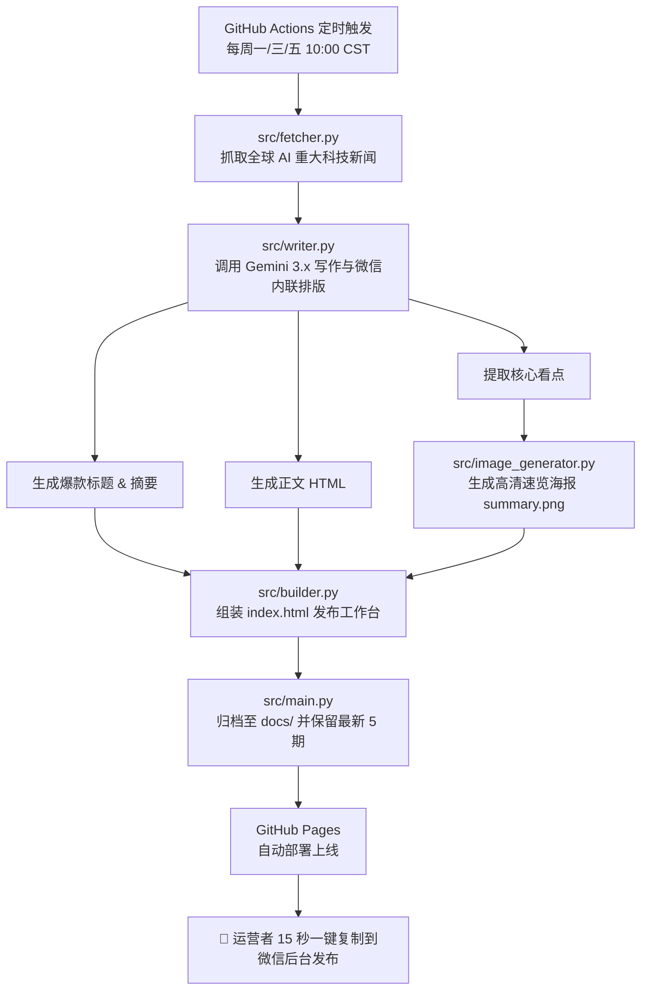

# 🤖 微信公众号 AI 大模型科技早报自动化流水线 (WeChat AI Daily)

> 基于 **GitHub Actions + Google Gemini 3.x + GitHub Pages** 的全自动大模型资讯采集、智能成稿、高质感自媒体排版与一键发文系统。零服务器成本，专为微信个人订阅号打造。

---

## 📌 项目背景与核心特色

微信个人订阅号受限于官方接口权限，无法直接通过 API 进行无人值守群发。本项目采用目前业内最优雅、最稳定的**“99% 自动化 + 1% 手动极速确认”**架构：

* **全球热点自动追踪**：定时聚合 TechCrunch、VentureBeat、The Verge 及 Hugging Face 顶尖大模型动态。
* **Google Gemini 3.x 深度撰稿**：智能提炼高价值科技新闻，自动产出爆款标题、精炼摘要与深度锐评。
* **微信原生黄金排版**：严格遵循微信编辑器内联 CSS 渲染机制，采用防拉伸、防缩进的科技蓝胶囊标与温润微卡片。
* **自动生成速览海报**：基于 Pillow 自动绘制 800px 高清科技风速览长图（`summary.png`），供朋友圈及社群分发。
* **极速发文工作台**：生成专属静态网页，内置**标题复制、摘要复制、正文一键复制**，将日常发文压缩至 15 秒内。
* **历史版本自动归档**：按执行时间戳归档，严格滚动保留最新 5 期，避免仓库臃肿。

---

## 🏗️ 系统架构图



---

## 🚀 运营者日常发文指南（15 秒极速流程）

每逢周一、三、五早上 10:00，云端自动出稿后，执行以下步骤即可完成发布：

1. **打开专属发布工作台**：
   访问你的 GitHub Pages 网址：`https://<你的用户名>.github.io/wechat-ai-daily/`。
2. **复制标题与摘要**：
   * 在页面顶部的【微信后台一键发文助手】中，点击 **【复制标题】** ➔ 粘贴至微信公众平台标题栏。
   * 点击 **【复制摘要】** ➔ 粘贴至微信公众平台摘要栏。
3. **复制并粘贴正文**：
   * 点击右上角绿色大按钮 **【📋 一键复制正文排版】**。
   * 打开微信公众号后台编辑器，光标置于正文区，按键盘快捷键 **`Ctrl + V`（Mac 按 `Cmd + V`）**。
   * 包含科技封面、胶囊标签、新闻卡片与高亮标注的完整排版将瞬间呈现。
4. **保存封面与摘要图（可选）**：
   * 点击 **【⬇️ 下载原尺寸摘要海报】**，可作为文章封面图或发布到微信朋友圈/社群引流。
5. **点击群发**，完成发布！

---

## 🛠️ 初次部署与环境搭建

如果你要重新部署一套或迁移到新账号，请按以下步骤操作：

### 1. 准备密钥
* 前往 [Google AI Studio](https://aistudio.google.com/) 创建并获取 `GEMINI_API_KEY`。

### 2. 配置 GitHub Repository Secrets
1. 进入 GitHub 仓库 ➔ **Settings** ➔ **Secrets and variables** ➔ **Actions**。
2. 点击 **New repository secret**，添加：
   * `GEMINI_API_KEY`: 填入你的 Google Gemini API 密钥。
   * `SERVERCHAN_KEY`: *(可选)* 填入 Server酱 SendKey，用于出稿后向手机微信推送提醒。

### 3. 配置 GitHub Actions 读写权限
进入仓库 ➔ **Settings** ➔ **Actions** ➔ **General** ➔ 滚动到底部 **Workflow permissions**：
* 勾选 **`Read and write permissions`** ➔ 点击 **Save**（确保机器人能自动提交生成的文章）。

### 4. 开启 GitHub Pages
进入仓库 ➔ **Settings** ➔ **Pages**：
* **Source**: 选择 `Deploy from a branch`。
* **Branch**: 选择 `main` 分支，目录选择 `/docs` ➔ 点击 **Save**。
* 稍等 1~2 分钟即可生成你的专属网站。

---

## 📂 项目目录结构说明

```text
wechat-ai-daily/
├── .github/
│   └── workflows/
│       └── daily_news.yml      # GitHub Actions 自动化定时工作流
├── docs/                       # GitHub Pages 静态网站根目录
│   ├── assets/
│   │   └── cover.jpg           # 6 大巨头高清科技封面图（长期图床）
│   ├── YYYY-MM-DD_HH-MM-SS/    # 历史执行版本归档（自动滚动保留最新 5 期）
│   │   ├── index.html
│   │   └── summary.png
│   ├── index.html              # 供外部访问的最新一期发布工作台
│   └── summary.png             # 最新一期速览海报
├── src/
│   ├── fetcher.py              # 全球 AI/大模型科技新闻采集器 (RSS/API)
│   ├── writer.py               # Gemini 3.x 写作、微信内联 CSS 排版与降级引擎
│   ├── image_generator.py      # Pillow 高清信息图海报生成器
│   ├── builder.py              # 网页组装器（含一键复制逻辑与样式）
│   └── main.py                 # 主执行调度入口、历史归档清理与通知分发
├── requirements.txt            # Python 运行时依赖
├── cover.jpg                   # 封面原图镜像
└── README.md                   # 开发者与运营文档
```

---

## 👨‍💻 二次开发与功能定制指南

### 1. 本地运行与调试

```bash
# 1. 克隆仓库
git clone https://github.com/<你的用户名>/wechat-ai-daily.git
cd wechat-ai-daily

# 2. 安装依赖
pip install -r requirements.txt

# 3. 设置临时环境变量
export GEMINI_API_KEY="AIzaSy..."   # Linux/macOS
# $env:GEMINI_API_KEY="AIzaSy..."  # Windows PowerShell

# 4. 执行完整流程测试
python src/main.py
```
运行完成后，可在本地浏览器直接双击打开 `docs/index.html` 预览效果。

---

### 2. 核心模块定制方式

#### A. 修改新闻抓取源 (`src/fetcher.py`)
可在 `aggregate_news()` 中增减 RSS 订阅源或爬虫源。例如增加国内媒体、arXiv 论文或特定行业科技源。

#### B. 调整模型提示词与微信排版 (`src/writer.py`)
* **文风与栏目调整**：修改 `SYSTEM_PROMPT` 中的栏目设定与字数要求。
* **微信原生排版避坑规则**：
  > [!IMPORTANT]
  > 微信富文本编辑器对外部 CSS 支持度极低，且对 `display: inline-block` 会强制拉伸，并可能继承 `text-indent: 2em`。
  > 所有小标题必须使用 `<section style="display: table; text-indent: 0; ...">` 结构，确保在微信中紧贴文字、不通栏拉伸且表情符前无缩进空白。
* **模型调用机制**：
  * 首选 `gemini-3.8-flash`（带 3 次 503 弹性退避重试）。
  * 自动无缝降级至 `gemini-3.6-flash` 及当前 API Key 授权的其他 3.x 活跃模型，坚决剔除已下线的 2.x/1.x 旧模型。

#### C. 修改海报设计与尺寸 (`src/image_generator.py`)
* 海报默认宽度为 800px，采用深蓝微质感卡片风格。
* GitHub Actions 运行环境在 `.github/workflows/daily_news.yml` 中自动安装了 `fonts-wqy-microhei` 矢量中文字体，确保云端文字渲染清晰无乱码。

#### D. 修改定时发送时间与频率 (`.github/workflows/daily_news.yml`)
修改 workflow 中的 cron 表达式：
```yaml
on:
  schedule:
    # 目前设置为：每周一、三、五 中国时间 10:00 (即 UTC 02:00)
    - cron: '0 2 * * 1,3,5'
```
* 如需每天早上 8:30 执行，可修改为：`'30 0 * * *'`（UTC 00:30）。

---

## ❓ 常见问题排查 (FAQ)

#### Q1: 打开 GitHub Pages 出现 404？
* 确认仓库 **Settings ➔ Pages** 已启用，Source 为 `Deploy from a branch`，分支为 `main`，目录为 `/docs`。
* 首次启用或刚提交后，GitHub 需 1~2 分钟构建，可在 Actions 页面查看 `pages build and deployment` 进度。
* 强制刷新浏览器缓存（`Ctrl + F5`）或在隐身窗口打开。

#### Q2: 遇到 Gemini 接口返回 HTTP 503？
* 503 代表 Google 全球集群瞬时流量高峰（`high demand spike`）。代码已内置 3 次指数退避自动重试，通常几秒内即可恢复；若持续高峰，会自动降级调用 `3.6-flash`。

#### Q3: 复制到微信后台后图片无法加载？
* 微信会在粘贴富文本时实时下载图片并转存到腾讯 CDN。请确保封面图片使用的是绝对路径（如项目已配置好的 GitHub Pages 图床链接）。

---

## 📄 License
MIT License. 欢迎自由 Fork、修改与分发！
